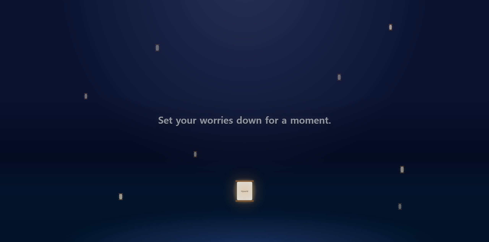
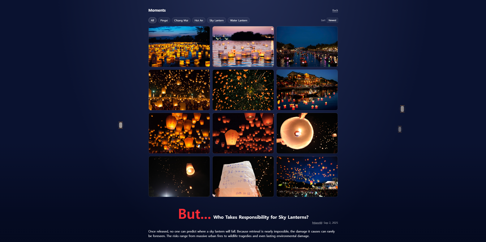

<div align="center">
  
</div>

# Drift Lanterns

> 고민이나 소망을 담아 랜턴을 띄우는 1분 온라인 명상 앱

🔗 **[https://htjworld.github.io/drift-lanterns/](https://htjworld.github.io/drift-lanterns/)**

## Background

풍등은 하늘로 날아올라 산불을 일으키고, 수면 위를 떠다니는 연등은 해양 동물에게 위협이 됩니다.
그럼에도 랜턴은 아름답고, 그 안에 바람을 담아 보내는 행위 자체는 사람에게 의미가 있습니다.

현실의 랜턴을 대체할 온라인 명상 경험을 만들고 싶었습니다.
풍등도 연등도 아닌, 이 서비스에서만 존재하는 제3의 등입니다.

고민이나 소망을 적어 랜턴을 띄우고 1분간 명상합니다.
심난한 친구들이 잠깐이라도 마음을 내려놓을 수 있으면 좋겠다는 마음으로 만들었습니다.

## Features

- 랜턴 날리기 — 고민이나 소망을 적고 등을 띄워 보내기
- 1분 명상 — 랜턴이 올라가는 동안 테마별 명상 문구 안내 (5가지 테마 랜덤 제공)
- Moments 갤러리 — 세계 랜턴 축제 사진 모음과 환경적 경각심을 함께 전달

## Preview

<div align="center">

| 랜턴 날리기 화면 |
|:---:|
|  |

| Moments 갤러리 화면 |
|:---:|
|  |

</div>

## Language

영어(English)를 지원합니다.

## Tech Stack

**Frontend**

[](https://skillicons.dev)

## Getting Started

**Requirements**
- Node.js 18+

**macOS / Linux / Windows**
```bash
git clone https://github.com/htjworld/drift-lanterns.git
cd drift-lanterns
npm install
npm run dev
```

## License

MIT © htjworld
